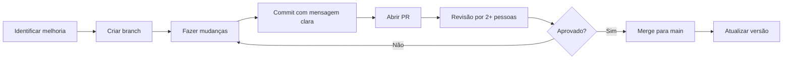

# Guia de Contribuição - Ávila Inc Padrão de Atendimento

> **Versão**: 1.0.0  
> **Para**: Toda equipe Ávila Inc  
> **Última atualização**: 12/11/2025

---

## 🎯 Filosofia

Este repositório é **versionado** e segue controle de mudanças rigoroso.

**Regra de Ouro**: Nada vai ao ar sem Pull Request (PR) aprovado.

---

## 🔄 Workflow de Contribuição



---

## 📝 Quando Criar PR

### SEMPRE que mudar:

- Scripts de atendimento (`scripts/`)
- Playbooks de procedimento (`playbooks/`)
- Prompts de IA (`ia_assistiva/`)
- Padrão de Atendimento mestre
- Qualquer processo crítico

### PODE mudar direto (sem PR):

- Dossiês de clientes individuais (privado)
- Anotações pessoais
- Rascunhos em `/drafts/` (se criar essa pasta)

---

## 🌿 Nomenclatura de Branches

| Tipo de Mudança | Formato | Exemplo |
|-----------------|---------|---------|
| **Nova feature** | `feature/descricao` | `feature/script-inadimplencia` |
| **Correção de bug** | `fix/descricao` | `fix/typo-primeiro-contato` |
| **Melhoria de processo** | `improve/descricao` | `improve/sla-response-time` |
| **Atualização de docs** | `docs/descricao` | `docs/atualizar-readme` |

---

## ✍️ Mensagens de Commit

### Formato

```
<tipo>(<escopo>): <descrição curta>

<descrição detalhada - opcional>

<rodapé - opcional>
```

### Tipos

- `feat`: Nova funcionalidade/script
- `fix`: Correção de erro
- `docs`: Mudança apenas em documentação
- `style`: Formatação (não muda lógica)
- `refactor`: Reestruturação sem mudar comportamento
- `test`: Adicionar/corrigir testes
- `chore`: Tarefas de manutenção

### Exemplos

```bash
# Bom ✅
feat(scripts): adicionar script de inadimplência
fix(playbooks): corrigir SLA de casos críticos para 2h
docs(README): atualizar estrutura de diretórios

# Ruim ❌
atualização
correções
mexeu no script
```

---

## 👥 Processo de Revisão de PR

### Checklist do Autor

Antes de abrir PR:

- [ ] Testei a mudança? (se aplicável - ex: rodei script atualizado)
- [ ] Atualizei a documentação relacionada?
- [ ] Atualizei número de versão do arquivo? (veja seção Versionamento)
- [ ] Mensagem de commit está clara?
- [ ] Removi dados sensíveis/PII? (nunca commitar!)

### Checklist dos Revisores (mínimo 2)

- [ ] Mudança faz sentido para o negócio?
- [ ] Está alinhada com valores Ávila Inc?
- [ ] Não há erro de português/formatação?
- [ ] Não há vazamento de dados confidenciais?
- [ ] Se é script, testei em cenário real/simulado?

### Quem Pode Aprovar

| Tipo de Mudança | Aprovadores Necessários |
|-----------------|-------------------------|
| **Scripts/Prompts** | 2 atendentes OU 1 supervisor |
| **SLA/Políticas** | 1 supervisor + 1 diretor |
| **Processos críticos** | 2 diretores |
| **Dossiês individuais** | Dono do caso + 1 revisor |

---

## 🔢 Versionamento Semântico

Usamos **SemVer** (Semantic Versioning): `MAJOR.MINOR.PATCH`

### Quando incrementar:

- **MAJOR** (1.0.0 → 2.0.0): Mudança que quebra compatibilidade (ex: reestruturar todo o processo)
- **MINOR** (1.0.0 → 1.1.0): Nova funcionalidade sem quebrar o existente (ex: novo script)
- **PATCH** (1.0.0 → 1.0.1): Correção de bug, typo (ex: fix de erro de digitação)

### Onde atualizar versão:

No cabeçalho de cada arquivo Markdown:

```markdown
> **Versão**: 1.2.3  
> **Data**: 12/11/2025
```

E no `README.md` principal se for mudança significativa.

---

## 📁 Estrutura de Diretórios (Padrão)

```
avila_inc_padrao_atendimento/
├── README.md
├── PADRAO_ATENDIMENTO_EXCELENCIA.md
├── CONTRIBUTING.md                    # Este arquivo
├── CHANGELOG.md                       # Log de mudanças
├── clientes/
│   └── [nome_cliente]/
│       ├── dossie.md
│       ├── historico_atendimento.md
│       └── plano_acao_[projeto].md
├── scripts/
│   ├── primeiro_contato.md
│   ├── caso_critico.md
│   ├── escalonamento.md
│   ├── inadimplencia.md
│   └── [outros].md
├── playbooks/
│   ├── sla_response_times.md
│   ├── classificacao_demandas.md
│   ├── gestao_crises.md
│   └── privacidade_lgpd.md
├── ia_assistiva/
│   ├── prompts_atendimento.md
│   ├── analise_conversa.py
│   └── guidelines_ia.md
└── templates/
    ├── template_dossie.md
    ├── template_proposta.md
    └── template_relatorio.md
```

**Regra**: Não criar pastas aleatórias. Se precisar de nova estrutura, abrir issue antes.

---

## 🔒 Segurança e Privacidade

### ❌ NUNCA commitar:

- CPF, RG, CNH, passaporte
- Senhas, tokens, API keys
- Dados bancários (IBAN, conta, agência)
- Informações médicas/saúde
- Qualquer PII sem pseudonimização

### ✅ Como tratar dados sensíveis:

1. **Anonimizar**: "Cliente A" em vez de "João Silva"
2. **Pseudonimizar**: Hash (`cliente_abc123`) em vez de email real
3. **Classificar**: Marcar arquivo como "RESTRITO" se contiver dado confidencial
4. **Cofre**: Dados críticos em sistema de cofre (não em Git)

### Se acidentalmente commitar dado sensível:

1. **NÃO** fazer novo commit "apagando" (fica no histórico)
2. **Avisar** imediatamente supervisor/DPO
3. **Reescrever** histórico Git (git rebase) OU
4. **Deletar** repositório e recriar (se necessário)

---

## 🧪 Testes de Scripts

Antes de aprovar mudança em script:

### Para Scripts de Atendimento

1. **Teste de linguagem**: Pedir para alguém de fora da equipe ler e ver se entendeu
2. **Teste de tom**: Está empático? Resolutivo? Claro?
3. **Teste de completude**: Tem todos os elementos da anatomia de resposta?

### Para Prompts de IA

1. **Teste com caso real** (anonimizado): Rodar prompt e ver se output faz sentido
2. **Teste de edge cases**: O que acontece se input for muito curto/longo/estranho?
3. **Teste de segurança**: IA está sugerindo algo antiético/inseguro?

---

## 📊 Changelog

Manter `CHANGELOG.md` atualizado:

```markdown
# Changelog

## [1.1.0] - 2025-11-15
### Added
- Script de gestão de inadimplência (#23)
- Prompt de IA para análise de churn (#24)

### Changed
- SLA de caso crítico: 4h → 2h (#25)
- Melhorias no template de primeiro contato (#26)

### Fixed
- Typo no playbook de LGPD (#27)

## [1.0.0] - 2025-11-12
### Added
- Versão inicial do Padrão de Atendimento de Excelência
- Dossiê do cliente Arkana Store (primeiro cliente)
- Scripts: primeiro_contato, caso_critico
- Prompts de IA assistiva
```

---

## 🤝 Cultura de Colaboração

### Princípios

1. **Todos podem contribuir**: Júnior ou senior, se viu melhoria, proponha
2. **Revisar é ensinar**: Aproveite PR para compartilhar conhecimento
3. **Discordar com respeito**: Debate saudável melhora o processo
4. **Iterar rápido**: Melhor fazer PR pequeno e rápido do que perfeito e demorado

### Etiqueta de PR

- **Descrição clara**: O que mudou e POR QUÊ
- **Tamanho razoável**: Ideal < 300 linhas (exceto docs grandes)
- **Responsivo**: Responder comentários em < 24h
- **Agradecer revisores**: Reconhecer o tempo investido

---

## 📞 Dúvidas?

- **Processo de PR**: Perguntar no #atendimento-processo (Slack/Teams)
- **Conteúdo de script**: Discutir com supervisor
- **Questões técnicas Git**: Perguntar no #tech-support

---

## 🎓 Recursos de Aprendizado

### Git Básico

- [Tutorial Git interativo](https://learngitbranching.js.org/)
- [Guia de Git em português](https://git-scm.com/book/pt-br/v2)

### Markdown

- [Markdown Guide](https://www.markdownguide.org/)
- [Cheatsheet rápido](https://github.com/adam-p/markdown-here/wiki/Markdown-Cheatsheet)

---

**Última atualização**: 12/11/2025  
**Dúvidas ou sugestões**: Abrir issue ou chamar [@responsavel]

---

*Ávila Inc - Excelência através de processo versionado e melhoria contínua*
