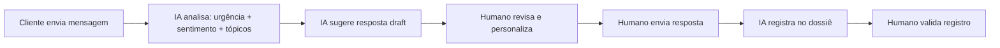

# Padrão de Atendimento de Excelência - Ávila Inc

> **Documento Mestre**  
> **Versão**: 1.0.0  
> **Data**: 12/11/2025  
> **Autor**: Ávila Inc  
> **Revisores**: [Pending]

---

## 1. Fundamentos

### 1.1 Identidade do Atendimento

**O que somos**:
- Consultoria que **acelera resultados financeiros** (redução custo + aumento receita)
- **100% humanos** no atendimento, com IA como ferramenta assistiva
- Parceiros de **confiança** para empresas BR e PT

**Como operamos**:
- Atendimento **claro, respeitoso e resolutivo**
- **Empatia + Ação**: entender problema e resolver
- **Transparência total**: cliente sabe o que está acontecendo, sempre

### 1.2 Promessa ao Cliente

> *"Você terá uma resposta clara, com próximos passos definidos e responsável identificado, em até 4 horas úteis. Problemas complexos terão plano de ação em 24 horas."*

---

## 2. SLA e Tempos de Resposta

### 2.1 Classificação de Urgência

| Nível | Critério | FRT | Resolução |
|-------|----------|-----|-----------|
| **🔴 Crítico** | Site fora do ar, perda de receita ativa, bloqueio legal | 2h úteis | Plano em 12h |
| **🟡 Urgente** | Impacto financeiro iminente, prazo regulatório próximo | 4h úteis | Plano em 24h |
| **🟢 Normal** | Otimização, dúvida, solicitação padrão | 4h úteis | 24-48h úteis |
| **⚪ Baixo** | Informação, follow-up agendado | 8h úteis | 72h úteis |

### 2.2 Definições

- **FRT** (First Response Time): Tempo até primeira resposta humana
- **Resolução**: Tempo até solução completa OU plano de ação aprovado
- **Horas úteis**: Segunda a sexta, 9h-18h (horário local BR ou PT conforme cliente)

### 2.3 Escalonamento

Se não conseguir resolver no prazo:
1. **+2h antes do deadline**: Avisar cliente com nova estimativa
2. **+4h antes do deadline**: Escalonar para supervisor
3. **No deadline**: Cliente recebe plano de ação documentado

---

## 3. Estrutura da Resposta

### 3.1 Anatomia da Resposta Perfeita

Toda resposta **deve conter**:

```markdown
Olá [Nome],

[EMPATIA] 
Entendo [reformular problema com palavras próprias].

[ANÁLISE]
Identifiquei que [causa raiz ou hipótese].

[AÇÃO]
Vou [próximos passos concretos]:
1. [Ação 1] - prazo: [quando]
2. [Ação 2] - prazo: [quando]

[RESPONSABILIDADE]
Responsável: [Nome]
Retorno previsto: [data/hora]

[PERGUNTA/VALIDAÇÃO]
Isso resolve sua necessidade imediata ou precisa de algo mais urgente?

Att,
[Nome] - Ávila Inc
```

### 3.2 O que NUNCA fazer

❌ Respostas genéricas tipo "estamos analisando"  
❌ Promessas sem prazo ou responsável  
❌ Jargão técnico sem explicação  
❌ Ignorar emoção do cliente (frustração, urgência)  
❌ Deixar cliente sem próximo passo claro  

---

## 4. Scripts Versionados

### 4.1 Primeiro Contato (Novo Cliente)

**Arquivo**: `scripts/primeiro_contato.md`

```markdown
Olá [Nome], prazer em conhecê-lo(a)!

Sou [Seu Nome], consultor(a) da Ávila Inc. Vi que você entrou em contato sobre [motivo].

Para eu te ajudar da melhor forma, preciso entender:
1. Qual é o impacto financeiro atual? (ex: quanto está perdendo/deixando de ganhar)
2. Qual o prazo ideal para resolver?
3. Já tentou alguma solução? Se sim, qual?

Com essas informações, monto um plano de ação personalizado para você.

Aguardo seu retorno!

Att,
[Seu Nome]
Ávila Inc | Consultoria BR ↔ PT
```

### 4.2 Caso Crítico (Site Fora/Perda Receita)

**Arquivo**: `scripts/caso_critico.md`

```markdown
[Nome], entendi a urgência - site fora é prioridade máxima.

AÇÃO IMEDIATA:
✅ Caso escalado para prioridade CRÍTICA
✅ Análise técnica iniciada agora
✅ Retorno com diagnóstico em [2 horas]

RESPONSÁVEL: [Seu Nome] + [Técnico Senior]

Enquanto isso, você pode:
- [Ação paliativa 1, se aplicável]
- [Ação paliativa 2, se aplicável]

Vou te atualizar a cada [1 hora] até resolver.

Att,
[Seu Nome] - Ávila Inc
📱 [WhatsApp direto se precisar]
```

### 4.3 Entrega de Plano de Ação (Caso Complexo)

**Arquivo**: `scripts/plano_acao.md`

```markdown
[Nome], analisamos seu caso a fundo. Aqui está o plano:

🎯 OBJETIVO
[Resultado esperado em métrica mensurável]

📊 SITUAÇÃO ATUAL
[Baseline - números atuais]

📋 PLANO 30-60-90 DIAS

**30 dias** (até [data]):
- [Entrega 1]
- [Entrega 2]
- Métrica de sucesso: [X]

**60 dias** (até [data]):
- [Entrega 3]
- [Entrega 4]
- Métrica de sucesso: [Y]

**90 dias** (até [data]):
- [Entrega 5]
- [Resultado final]
- Métrica de sucesso: [Z]

💰 INVESTIMENTO: [Valor] ou [Modelo de precificação]
📅 PRÓXIMA REUNIÃO: [Data/hora para aprovar plano]

Dúvidas? Me chame!

Att,
[Seu Nome] - Ávila Inc
```

---

## 5. Registro e Dossiê do Cliente

### 5.1 O que Registrar

**Todo contato relevante vira nota no dossiê**:
- ✅ Data/hora do contato
- ✅ Canal (WhatsApp, email, call)
- ✅ Resumo do problema
- ✅ Ação tomada
- ✅ Próximo passo
- ✅ Métrica de impacto (quando aplicável)

### 5.2 Estrutura do Dossiê

**Arquivo**: `clientes/[nome_cliente]/dossie.md`

```markdown
# Dossiê - [Nome Cliente]

## Dados Cadastrais
- **Razão Social**: [Nome completo]
- **Responsável**: [Nome pessoa contato]
- **Email**: [email]
- **Telefone**: [telefone]
- **País**: BR | PT
- **Segmento**: [área de atuação]
- **Data Início**: [primeira interação]

## Situação Financeira Baseline
- **Receita mensal**: [R$ X ou confidencial]
- **Margem**: [X% ou confidencial]
- **Principais custos**: [lista]
- **Dor principal**: [problema que mais impacta]

## Histórico de Atendimento
[Ver arquivo: historico_atendimento.md]

## Projetos Ativos
[Ver arquivo: plano_acao_[projeto].md]

## Métricas de Sucesso
- **Redução de custo**: [X%]
- **Aumento de receita**: [Y%]
- **Payback**: [Z meses]
- **CSAT**: [Score]

## Observações Importantes
- [Preferências de comunicação]
- [Restrições conhecidas]
- [Oportunidades identificadas]
```

---

## 6. Privacidade e LGPD/GDPR

### 6.1 Regras de Ouro

1. **Coleta Mínima**: Só peça o necessário para resolver o problema
2. **Finalidade Explícita**: Cliente sabe por que você está pedindo aquele dado
3. **Retenção Curta**: Após projeto, anonimizar ou excluir (conforme contrato)
4. **Pseudonimização**: Nos relatórios internos, use "Cliente A" em vez de nome real
5. **Cofres**: Senhas, credenciais, PII ficam em cofre (não em chat/email)

### 6.2 Dados Sensíveis Detectados

Se o script de análise detectar CPF, email pessoal, telefone:

**Ação imediata**:
1. Avisar cliente: "Oi [Nome], vi que você compartilhou [dado]. Por segurança LGPD, vou registrar apenas [versão anonimizada] no nosso sistema. Ok?"
2. No dossiê: Usar pseudônimo ou hash
3. Marcar campo como "restrito" no sistema

### 6.3 Proibido

❌ Colocar PII em issues públicas  
❌ Fazer screenshot com dados sensíveis sem ocultação  
❌ Treinar LLM com dados de clientes  
❌ Compartilhar dossiê sem aprovação expressa  

---

## 7. IA Assistiva (Human-in-the-Loop)

### 7.1 Filosofia

> *"IA sugere, humano decide. IA acelera, humano valida. IA nunca substitui juízo ético e empatia."*

### 7.2 Usos Permitidos de IA

✅ **Análise de conversa**: Identificar urgência, sentimento, tópicos  
✅ **Sugestão de resposta**: Draft inicial (humano sempre revisa e personaliza)  
✅ **Extração de dados**: OCR, parsing de documentos  
✅ **Pesquisa de conhecimento**: Buscar soluções em base de conhecimento interna  
✅ **Métricas**: Calcular KPIs, gráficos, tendências  

### 7.3 Usos Proibidos de IA

❌ **Resposta automática sem revisão humana**  
❌ **Decisão final sobre caso do cliente**  
❌ **Treinamento de modelo com dados de cliente**  
❌ **Análise de sentimento para "pontuação" de cliente**  
❌ **Substituir atendente em negociação ou conflito**  

### 7.4 Workflow com IA



### 7.5 Prompts para IA

**Arquivo**: `ia_assistiva/prompts_atendimento.md`

Exemplo:

```markdown
## Análise de Urgência

**Prompt**:
"""
Analise a mensagem abaixo e classifique a urgência (CRÍTICO/URGENTE/NORMAL/BAIXO).

Critérios:
- CRÍTICO: Site fora, perda de receita ativa, bloqueio legal
- URGENTE: Impacto financeiro iminente, prazo próximo
- NORMAL: Otimização, dúvida, solicitação padrão
- BAIXO: Informação, follow-up

Mensagem:
{mensagem_cliente}

Responda em JSON:
{
  "urgencia": "CRÍTICO|URGENTE|NORMAL|BAIXO",
  "justificativa": "...",
  "impacto_financeiro": "SIM|NÃO",
  "palavras_chave": ["palavra1", "palavra2"]
}
"""
```

---

## 8. Métricas e Melhoria Contínua

### 8.1 Dashboard de KPIs

| Métrica | Alvo | Como Medir |
|---------|------|------------|
| **FRT médio** | < 3h | Timestamp primeira resposta - timestamp solicitação |
| **TMA** (Tempo Médio Atendimento) | < 20h | Timestamp resolução - timestamp solicitação |
| **Taxa Resolução 1º Contato** | > 60% | % casos resolvidos sem reabrir |
| **CSAT** | > 90% | Pesquisa pós-atendimento (1-5) |
| **NPS** | > 50 | Pesquisa trimestral |
| **Taxa Recontratação** | > 80% | % clientes que renovam/compram novo projeto |

### 8.2 Retrospectiva Semanal

Toda sexta, 16h:
1. Revisar casos da semana
2. Identificar padrões (problemas recorrentes, scripts que funcionaram)
3. Propor melhorias em scripts/playbooks
4. Criar PR com mudanças
5. Aprovar e mergear

### 8.3 Feedback do Cliente

Após cada atendimento (24h depois):

```markdown
Oi [Nome]!

Só para garantir que ficou tudo ok: como foi sua experiência com nosso atendimento?

⭐⭐⭐⭐⭐ (1-5 estrelas)

O que podemos melhorar?

Obrigado!
Ávila Inc
```

---

## 9. Casos Especiais

### 9.1 Cliente Insatisfeito/Reclamação

**Script**: `scripts/gestao_conflito.md`

1. **Não se defender**: Primeiro, ouça completamente
2. **Validar sentimento**: "Entendo sua frustração, [Nome]. No seu lugar, eu também estaria [sentimento]."
3. **Assumir responsabilidade**: "A falha foi nossa em [X]. Peço desculpas."
4. **Plano de correção**: "Para corrigir, vou fazer [A, B, C] até [prazo]."
5. **Compensação (se aplicável)**: "[Desconto/bônus/extensão de prazo]"
6. **Follow-up**: Ligar (não só mensagem) em 24h para confirmar que está ok

### 9.2 Cliente Inadimplente

**Script**: `scripts/inadimplencia.md`

1. **Tom empático, não punitivo**: "Oi [Nome], notei que o pagamento de [data] ainda está pendente. Tudo ok por aí?"
2. **Oferecer solução**: "Se estiver com dificuldade de fluxo de caixa, podemos [parcelar/renegociar/adiar]."
3. **Pausa de serviços (se necessário)**: "Para continuar o projeto, precisamos regularizar até [data]. Posso ajudar nisso?"
4. **Registro**: Marcar no dossiê, NÃO publicar em canais abertos

### 9.3 Solicitação Fora do Escopo

**Script**: `scripts/fora_escopo.md`

```markdown
Oi [Nome],

Entendi que você precisa de [X]. 

Esse serviço não está coberto pelo nosso contrato atual (que foca em [Y e Z]).

Opções:
1. Posso fazer um orçamento separado para [X] - te envio em [prazo]
2. Posso indicar um parceiro especializado em [X]
3. Podemos revisar o escopo do contrato para incluir [X] nos próximos meses

O que prefere?

Att,
[Nome]
```

---

## 10. Integração com Produtos Ávila

### 10.1 Produtos/Serviços

1. **Consultoria Financeira**: Redução de custos, análise DRE, fluxo de caixa
2. **Consultoria Operacional**: Processos, automação, eficiência
3. **Consultoria Digital**: E-commerce, marketing, analytics
4. **Assessoria Tributária BR/PT**: Compliance, otimização fiscal
5. **Projetos Customizados**: [Conforme necessidade]

### 10.2 Cross-sell Ético

Ao identificar oportunidade:

```markdown
[Nome], enquanto analisava [problema X], notei que você também pode se beneficiar de [produto Y].

Isso porque [justificativa com métrica]:
- Potencial de redução de [R$ Z] em [tempo]
- Ou aumento de [X%] em [métrica]

Quer que eu prepare uma proposta rápida (sem compromisso)?

Att,
[Nome]
```

**Regra**: Só oferecer se houver impacto financeiro real e mensurável. Nunca empurrar produto.

---

## 11. Compliance e Ética

### 11.1 Conflitos de Interesse

Se houver relação comercial que possa influenciar recomendação:

**Declarar explicitamente**:
```markdown
[Nome], vou recomendar [ferramenta X]. 

Importante você saber: temos parceria comercial com [fornecedor], então recebemos [comissão/desconto]. 

Mesmo assim, acredito que é a melhor opção porque [justificativa técnica].

Se preferir uma segunda opinião independente, posso buscar alternativas sem relação comercial nossa.

Att,
[Nome]
```

### 11.2 Recusar Projetos

Se projeto exigir práticas questionáveis (anti-privacidade, ilegal, antiética):

**Recusar com educação**:
```markdown
[Nome], agradeço a confiança, mas não conseguimos atender projetos que envolvam [prática X].

Isso vai contra nossa política de [ética/privacidade/compliance].

Posso indicar [alternativa] ou discutir outra abordagem que atenda sua necessidade sem [problema]?

Att,
[Nome]
```

---

## 12. Checklist Diário do Atendente

### Início do Dia (9h)
- [ ] Revisar casos pendentes
- [ ] Priorizar por urgência (Crítico > Urgente > Normal)
- [ ] Atualizar status no dossiê dos clientes
- [ ] Responder mensagens overnight (se houver)

### Durante o Dia
- [ ] FRT < 4h para todos os casos
- [ ] Registrar cada interação no dossiê
- [ ] Escalonar se não conseguir resolver no prazo
- [ ] Atualizar cliente a cada marco importante

### Fim do Dia (18h)
- [ ] Todos os casos têm próximo passo definido?
- [ ] Clientes foram avisados se algo ficou pendente?
- [ ] Dossiês atualizados?
- [ ] Preparar hand-off se caso crítico continuar no dia seguinte

---

## 13. Treinamento e Onboarding

### 13.1 Novo Atendente - Semana 1

**Dia 1-2**: Leitura
- `avila_inc_missao_valores_filosofia_e_diretrizes_2025.md`
- `PADRAO_ATENDIMENTO_EXCELENCIA.md` (este arquivo)
- Todos os scripts em `scripts/`

**Dia 3-4**: Shadowing
- Acompanhar atendente senior
- Observar 10+ atendimentos reais
- Fazer anotações de dúvidas

**Dia 5**: Prática Supervisionada
- Responder casos "Normal" com revisão do senior
- Receber feedback em tempo real

### 13.2 Certificação Interna

Para atender sozinho, atendente deve:
- [ ] Ter CSAT > 85% nos primeiros 20 atendimentos supervisionados
- [ ] Conhecer todos os scripts de cor
- [ ] Saber quando escalonar vs. resolver sozinho
- [ ] Entender LGPD/GDPR e privacidade
- [ ] Conseguir identificar urgência corretamente em 90%+ dos casos

---

## 14. Anexos e Referências

### 14.1 Documentos Relacionados

- `README.md` - Visão geral do repositório
- `scripts/` - Scripts versionados
- `playbooks/` - Procedimentos detalhados
- `ia_assistiva/` - Integração com IA
- `clientes/` - Dossiês (acesso restrito)

### 14.2 Atualizações

| Versão | Data | Mudanças | Autor |
|--------|------|----------|-------|
| 1.0.0 | 12/11/2025 | Versão inicial | Ávila Inc |

### 14.3 Aprovação

- [ ] Revisor 1: _______________
- [ ] Revisor 2: _______________
- [ ] Diretor: _______________

---

**Última atualização**: 12/11/2025  
**Próxima revisão**: 12/02/2026 (trimestral)

*Ávila Inc - Consultoria com atendimento 100% humano e IA assistiva*
