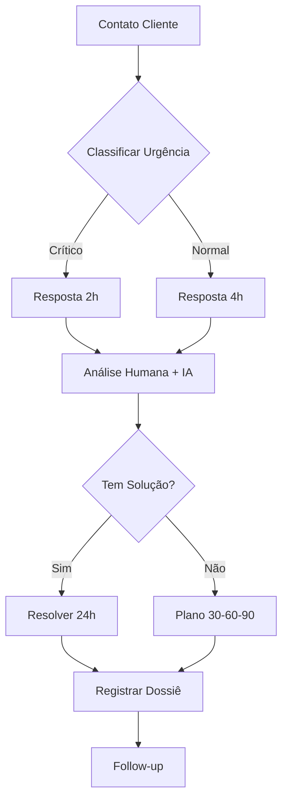

# Ávila Inc - Padrão de Atendimento de Excelência

> **Versão**: 1.0.0  
> **Data**: 12/11/2025  
> **Status**: Produção  
> **Filosofia**: Atendimento 100% humano com IA assistiva

---

## 📋 Estrutura do Repositório

```
avila_inc_padrao_atendimento/
├── README.md                           # Este arquivo
├── PADRAO_ATENDIMENTO_EXCELENCIA.md   # Documento mestre
├── clientes/                           # Dossiês de clientes
│   └── arkana_store/                  # Primeiro cliente
│       ├── dossie.md
│       ├── historico_atendimento.md
│       └── plano_acao_shopify.md
├── scripts/                            # Scripts versionados
│   ├── primeiro_contato.md
│   ├── escalonamento_urgente.md
│   ├── acompanhamento_caso.md
│   └── fechamento_atendimento.md
├── playbooks/                          # Procedimentos
│   ├── sla_response_times.md
│   ├── classificacao_demandas.md
│   ├── gestao_crises.md
│   └── privacidade_lgpd.md
└── ia_assistiva/                       # Integração IA
    ├── prompts_atendimento.md
    ├── analise_conversa.py
    └── guidelines_ia.md
```

---

## 🎯 Missão do Atendimento

Acelerar resultados financeiros dos clientes através de:
- ✅ Atendimento **claro, respeitoso e resolutivo**
- ✅ **Empatia + Ação** imediata
- ✅ Foco em **impacto mensurável**
- ✅ Transparência e ética absoluta

---

## ⚡ SLA e Compromissos

| Métrica | Alvo | Crítico |
|---------|------|---------|
| **FRT** (First Response Time) | 4h úteis | 2h úteis |
| **Resolução Padrão** | 24h úteis | 12h úteis |
| **Casos Complexos** | Plano de ação em 24h | Plano em 12h |
| **CSAT** (Satisfação) | ≥ 90% | ≥ 80% |
| **NPS** | ≥ 50 | ≥ 30 |

---

## 🔄 Fluxo de Atendimento



---

## 📊 Princípios Operacionais

1. **Cliente Primeiro**: Decisões orientadas a impacto financeiro real
2. **Excelência Humana**: IA assiste, humano decide e executa
3. **Rigor Analítico**: Hipóteses testáveis, métricas verificáveis
4. **Privacidade-First**: LGPD/GDPR por padrão
5. **Disciplina Operacional**: Tudo versionado, auditável e mensurável

---

## 🚀 Quick Start

### Para Atendentes

1. Leia `PADRAO_ATENDIMENTO_EXCELENCIA.md`
2. Use scripts em `scripts/` para padronizar respostas
3. Consulte playbooks em `playbooks/` para procedimentos
4. Registre tudo no dossiê do cliente em `clientes/[nome]/`

### Para Gestores

1. Monitore métricas de SLA e satisfação
2. Revise dossiês semanalmente
3. Aprove PRs de mudanças em scripts/playbooks
4. Audite conformidade LGPD mensalmente

### Para Desenvolvedores IA

1. Siga `ia_assistiva/guidelines_ia.md`
2. Use `ia_assistiva/prompts_atendimento.md` como base
3. **NUNCA** treine modelos com dados de clientes
4. Sempre mantenha human-in-the-loop

---

## 🔐 Segurança e Privacidade

- ✅ Dados sensíveis **apenas** em dossiês (não em issues/PRs)
- ✅ PII anonimizado em todas as comunicações públicas
- ✅ Acesso granular por função
- ✅ Audit trail de todas as ações
- ✅ Retenção mínima, pseudonimização máxima

---

## 📈 Métricas que Importam

### Cliente
- Redução de custo (%)
- Aumento de receita (%)
- Payback do projeto
- Margem de lucro

### Ávila
- CSAT/NPS
- FRT/TMA médio
- Taxa de resolução primeiro contato
- Taxa de recontratação
- Inadimplência

---

## 🛠️ Ferramentas

- **Comunicação**: WhatsApp Business (scripts versionados)
- **Gestão**: Dossiês em Markdown + Git
- **IA Assistiva**: Análise de conversa, sugestão de respostas (supervisão humana)
- **Métricas**: Dashboard de KPIs
- **Privacidade**: Cofres de segredos, pseudonimização

---

## 📝 Versionamento

Toda mudança em scripts, playbooks ou procedimentos **deve**:
1. Ser feita via Pull Request
2. Ter justificativa de negócio
3. Ser revisada por 2+ pessoas
4. Incluir número de versão

---

## 📞 Contato

**Ávila Inc**  
Consultoria empresarial BR ↔ PT  
100% atendimento humano | IA assistiva  

*Última atualização: 12/11/2025*
